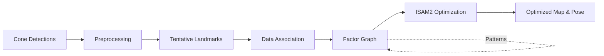

# ConeSTELLATION 🌟

**Cone-based STructural ELement Layout for Autonomous NavigaTION**

A novel Graph SLAM system for Formula Student Driverless that leverages **inter-landmark geometric constraints** between cones to achieve robust localization with sparse observations.

[](https://docs.ros.org/en/humble/)
[](https://gtsam.org/)
[](LICENSE)

## 🚀 Key Innovation: Inter-Landmark Factors

Traditional visual SLAM only creates constraints between poses and landmarks. **ConeSTELLATION** introduces a paradigm shift by adding geometric constraints **between co-observed cones**, extracting maximum information from the structured track environment.

### Why Inter-Landmark Factors Matter

In Formula Student racing:
- **Sparse observations**: Only 2-10 cones visible per frame
- **Structured environment**: Cones form track boundaries with geometric patterns
- **Co-visibility = Constraint**: When cones are seen together, their relative positions are highly informative

### Novel Factor Types

```
Traditional SLAM:                    ConeSTELLATION:
Pose ←→ Landmark                    Pose ←→ Landmark
Pose ←→ Pose                        Pose ←→ Pose
                                    Landmark ←→ Landmark ✨
                                    Pattern Constraints ✨
```

Our inter-landmark factors include:
- **Distance Constraints**: Preserve relative distances between co-observed cones
- **Angle Constraints**: Maintain angular relationships in cone triplets
- **Line Constraints**: Enforce collinearity for track boundary cones
- **Pattern Factors**: Leverage geometric patterns (parallel lines, curves)

## 🏎️ System Overview

ConeSTELLATION processes cone detections from LiDAR clustering with YOLO-based color classification, building a globally consistent map while tracking the vehicle pose in real-time.

### Architecture



### Core Features

- 🔧 **Modular Architecture**: Based on GLIM's proven plugin system
- ⚡ **Real-time Performance**: Multi-threaded processing pipeline (planned)
- 🎯 **Robust Data Association**: Color voting, track ID hysteresis, observation buffering
- 📊 **Advanced Optimization**: GTSAM with ISAM2 (incremental optimization)
- 🔄 **Loop Closure**: Cone constellation descriptors for place recognition (planned)
- 🤖 **ROS2 Native**: Full integration with ROS2 Humble

## 📋 Current Status

### ✅ Implemented
- Basic factor graph SLAM with ISAM2
- Inter-landmark distance factors (fully working!)
- Tentative landmark system with observation buffering
- Color voting and track ID management
- ROS2 node with comprehensive visualization
- Simulation environment with dummy publisher
- Drift correction (map→odom transform)
- Cone-based odometry estimation
- Track ID based data association

### 🚧 In Development (Priority Order)
1. Loop closure with cone constellations
2. Multi-threading architecture  
3. Robust kernels for outlier rejection
4. Pattern detection for advanced factors
5. Integration with external IMU/GPS odometry
6. Keyframe pruning strategy (if needed for >1 hour runs)

### 📈 Performance Targets
| Metric | Current | Target |
|--------|---------|--------|
| Update Rate | 10 Hz | 20+ Hz |
| Memory Usage | ~200MB | < 1GB |
| Loop Closure | 0% | > 90% |
| Color Accuracy | ~85% | > 95% |

## 🛠️ Building

### Prerequisites
- ROS2 Humble
- GTSAM 4.2+
- Eigen3
- Custom cone detection messages

### Build Instructions
```bash
cd ~/ROS2_Workspace/Symforce_ws
colcon build --packages-select cone_stellation --symlink-install
source install/setup.bash
```

## 🚀 Quick Start

### Simulation
```bash
# Terminal 1: Launch dummy cone publisher
ros2 launch cone_stellation dummy_publisher_launch.py

# Terminal 2: Run SLAM node
ros2 launch cone_stellation test_slam_launch.py

# Terminal 3: Visualize in RViz
rviz2 -d src/cone_stellation/config/cone_slam.rviz
```

### Real Data
```bash
# Play rosbag with cone detections
ros2 bag play your_cone_data.bag

# Run SLAM
ros2 run cone_stellation cone_slam_node
```

## 📚 Documentation

| Document | Description |
|----------|-------------|
| [SLAM Architecture](docs/SLAM_ARCHITECTURE.md) | Technical details of inter-landmark factors and system design |
| [Development Plan](docs/DEVELOPMENT_PLAN.md) | Roadmap, implementation phases, and current status |
| [GLIM Features](docs/glim_features_integration.md) | Advanced features from GLIM to be integrated |
| [Topic Structure](docs/topic_structure.md) | ROS2 topics and TF tree documentation |
| [Debug Log](docs/debug_log.md) | Chronological development history and solutions |

## 🔬 Technical Highlights

### Tentative Landmark System
Prevents false positives through observation buffering:
- Minimum 3 observations required
- Color voting with confidence thresholds
- Position variance validation
- Track ID hysteresis for occlusion handling

### Factor Graph Structure
```cpp
// Traditional factors
graph.add(OdometryFactor(x₁, x₂, odom_measurement));
graph.add(ConeObservationFactor(x₁, l₁, cone_detection));

// Novel inter-landmark factors
graph.add(ConeDistanceFactor(l₁, l₂, measured_distance));
graph.add(ConeLineFactor(l₁, l₂, l₃, line_constraint));
graph.add(ConeAngleFactor(l₁, l₂, l₃, angle_constraint));
```

### Planned Multi-threading Architecture
```
Main Thread          Preprocessing Thread     Mapping Thread
    │                      │                      │
    ├─ ROS callbacks       ├─ Cone filtering     ├─ Data association
    ├─ Keyframe select     ├─ Pattern detection  ├─ Factor creation
    └─ Visualization       └─ Color validation   └─ Optimization
```

## 🤝 Contributing

We welcome contributions! Key areas needing work:
- Loop closure algorithms
- Pattern detection (lines, curves)
- GPU acceleration
- Multi-vehicle coordination

## 📖 Citation

If you use ConeSTELLATION in your research, please cite:
```bibtex
@software{conestellation2025,
  title = {ConeSTELLATION: Inter-landmark Constrained SLAM for Formula Student},
  author = {Your Team},
  year = {2025},
  url = {https://github.com/yourusername/cone_stellation}
}
```

## 🙏 Acknowledgments

- **GLIM**: For the modular architecture inspiration
- **GTSAM**: For the powerful optimization backend
- **Formula Student Community**: For the challenging autonomous racing environment

---

*"When cones cluster together, they form constellations that guide our way"* 🌟