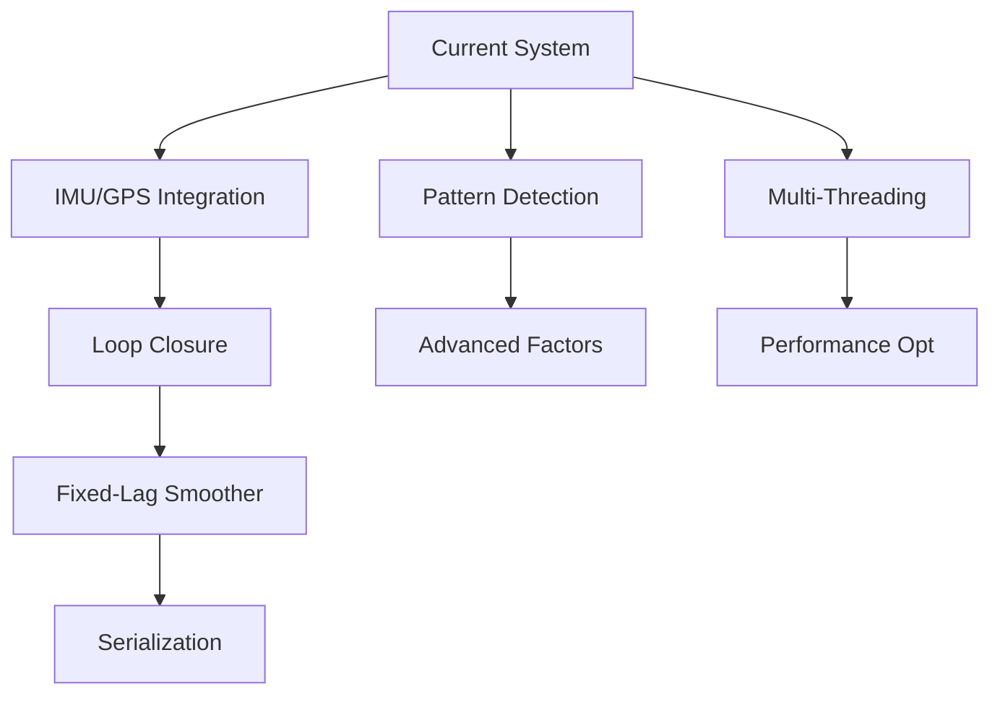

# ConeSTELLATION Future Development TODO List

## Overview
This document contains the prioritized list of features and improvements to be implemented in ConeSTELLATION. All listed items are NOT yet implemented as of 2025-07-20.

## Priority Levels
- 🔴 **HIGH**: Critical for production use or significant performance improvement
- 🟡 **MEDIUM**: Important enhancements that improve system robustness
- 🟢 **LOW**: Nice-to-have features or minor improvements

---

## 🔴 HIGH Priority Tasks

### 1. IMU/GPS Integration for High-Rate Odometry
**Goal**: Separate control-rate odometry (100+ Hz) from SLAM optimization (10-30 Hz)

**Technical Details**:
- Implement IMU preintegration factors following GTSAM's IMU factor model
- Add GPS factors for global consistency (when available)
- Create sensor fusion module combining wheel odometry, IMU, and GPS
- Maintain dual odometry sources: high-rate for control, SLAM for accuracy

**Dependencies**: None (foundational feature)

**Implementation Steps**:
1. Create IMU data buffer and preintegration module
2. Add GPS factor with proper covariance modeling
3. Implement time synchronization between sensors
4. Test with simulated IMU/GPS data first

### 2. Loop Closure Detection
**Goal**: Detect revisited locations and correct accumulated drift

**Technical Details**:
- Implement "cone constellation" descriptors for place recognition
- Use geometric verification to reduce false positives
- Add loop closure factors to the graph
- Handle large corrections smoothly

**Dependencies**: Stable mapping and optimization

**Implementation Steps**:
1. Design cone constellation descriptor (relative positions, colors)
2. Implement efficient matching with KD-tree or similar
3. Add geometric verification using RANSAC
4. Create loop closure factor and test convergence

### 3. Fixed-Lag Smoother Implementation
**Goal**: Bound memory usage for long-duration operation

**Technical Details**:
- Replace unbounded ISAM2 with fixed-lag smoother
- Maintain sliding window of recent poses and landmarks
- Marginalize out old states properly
- Keep key landmarks for loop closure

**Dependencies**: Current ISAM2 optimization working well

**Reference**: GTSAM's IncrementalFixedLagSmoother

---

## 🟡 MEDIUM Priority Tasks

### 4. Pattern Detection for Advanced Factors
**Goal**: Automatically detect and utilize geometric patterns in cone layouts

**Technical Details**:
- **Line Detection**: RANSAC-based fitting for straight sections
  - Create ConeLineFactor for detected lines
  - Handle both left and right track boundaries
- **Curve Detection**: Fit circular arcs or splines
  - Adaptive factor weights based on curvature
- **Parallel Lines**: Detect and maintain track width
  - Create ConeParallelLinesFactor

**Dependencies**: Basic inter-landmark factors working

**Implementation Steps**:
1. Implement RANSAC line fitting in ConePreprocessor
2. Add curve detection using least-squares circle fitting
3. Create pattern-to-factor mapping logic
4. Test on various track geometries

### 5. Multi-Threading Architecture
**Goal**: Achieve real-time performance with parallel processing

**Technical Details**:
- Separate threads for:
  - Sensor data reception
  - Preprocessing and pattern detection
  - Odometry estimation
  - Mapping and optimization
  - Visualization
- Use lock-free queues for inter-thread communication
- Implement proper synchronization

**Dependencies**: Stable single-threaded implementation

**Reference**: GLIM's multi-threading design

### 6. Robust Data Association Improvements
**Goal**: Handle challenging scenarios with occlusions and misclassifications

**Technical Details**:
- Implement Joint Compatibility Branch and Bound (JCBB)
- Add probabilistic data association
- Handle multiple hypotheses for ambiguous cases
- Improve track ID scoring with temporal consistency

**Dependencies**: Current data association working

---

## 🟢 LOW Priority Tasks

### 7. Enhanced Path Visualization
**Goal**: Better debugging and system understanding through visualization

**Technical Details**:
- Separate visualization of:
  - Raw odometry path (with drift)
  - Optimized SLAM path
  - Uncertainty ellipses
- Path color-coding by:
  - Velocity
  - Optimization confidence
  - Time
- Interactive path exploration in RViz

**Dependencies**: Basic visualization working

### 8. Advanced Inter-Landmark Factors
**Goal**: Utilize more geometric constraints beyond distance

**Technical Details**:
- Implement ConeAngleFactor (with proper Jacobians)
- Add ConeParallelLinesFactor for track boundaries
- Create adaptive factor weights based on:
  - Observation quality
  - Distance between landmarks
  - Number of co-observations

**Dependencies**: Basic inter-landmark factors stable

### 9. Performance Optimizations
**Goal**: Optimize for embedded deployment

**Technical Details**:
- Profile and optimize hot paths
- Implement sparse matrix optimizations
- Consider GPU acceleration for:
  - Pattern detection
  - Data association
  - Matrix operations
- Memory pool allocation for real-time guarantees

**Dependencies**: Feature-complete system

### 10. Serialization and Recovery
**Goal**: Save/load SLAM state for multi-session mapping

**Technical Details**:
- Serialize factor graph state
- Save landmark database
- Implement map merging from multiple sessions
- Handle version compatibility

**Dependencies**: Stable factor graph structure

---

## Task Dependencies Graph

---

## Testing Strategy for Each Task

### Unit Tests Required
- IMU preintegration accuracy
- Pattern detection robustness
- Loop closure descriptor matching
- Factor Jacobian verification

### Integration Tests Required
- Multi-sensor time synchronization
- Thread safety and race conditions
- Memory usage under long operation
- Loop closure convergence

### Performance Benchmarks
- Processing time per frame
- Memory usage over time
- Optimization convergence speed
- Pattern detection accuracy

---

## Success Metrics

| Feature | Target Metric |
|---------|--------------|
| IMU/GPS Integration | < 5ms latency, < 1% drift |
| Loop Closure | > 95% detection rate, < 1% false positive |
| Pattern Detection | > 90% line detection accuracy |
| Multi-Threading | > 50 Hz update rate |
| Memory Usage | < 1GB for 1-hour operation |

---

## Notes
- Review and update priorities quarterly
- Consider user feedback for priority adjustments
- Some tasks may reveal additional subtasks during implementation
- Keep this document synchronized with GitHub issues/projects