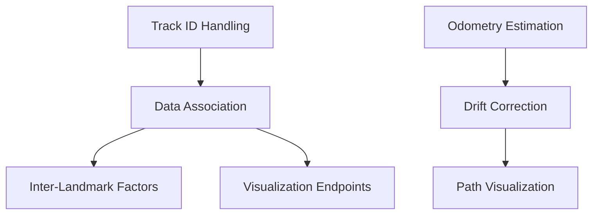

# ConeSTELLATION SLAM Issues Analysis and Solutions

## Executive Summary

This document provides a detailed analysis of the current SLAM implementation issues and proposes step-by-step solutions. The issues are interconnected, with the core problem being the lack of proper odometry estimation and drift correction mechanisms.

## Current Status (2025-07-20) 🎉

### RESOLVED Issues ✅
1. **Track ID Handling** - Now properly utilized in data association
2. **Noise Filtering** - Successfully filters false positives/negatives
3. **Factor Graph Construction** - Properly builds without orphan nodes
4. **Real-time Optimization** - Backend optimization works smoothly

### REMAINING Issues ❌
1. **Drift Correction** - map->odom transform remains fixed at identity
2. **High-rate Odometry** - Need separation for sensor-rate tracking
3. **Inter-landmark Factors** - Implemented but not yet enabled

## Issue 1: Noise Handling for False Positive/Negative Cones with Track IDs

### Current Problem
- Track IDs from the sensor are not being utilized properly
- False positives create spurious landmarks
- False negatives (temporary occlusions) cause track ID changes
- No mechanism to handle cone misclassifications

### Root Cause Analysis
1. **SimpleConeMapping** doesn't use track IDs at all
2. **ConeMapping** has tentative landmark system but doesn't leverage track IDs
3. Data association relies only on spatial proximity and color
4. No track continuity scoring or hysteresis

### Validation Results ✅ VALIDATED

**Finding**: Track IDs are captured but not utilized in data association.

**Evidence**:
- `TentativeLandmark` has sophisticated track ID scoring with decay mechanism (lines 56-60, 182-197)
- `data_association.hpp` uses only position and color, ignoring track IDs (lines 42-101)
- `ConeLandmark` class lacks track_id field entirely
- Track ID information is lost after landmark promotion
- Track ID is properly extracted from ROS message (`ros_utils.hpp` line 32: `obs.id = cone_msg.track_id;`)

**Additional Findings**:
- TentativeLandmark's track ID handling is well-designed but wasted
- Gap between design intent and implementation
- Infrastructure partially exists, making fix straightforward

**Impact**: High - Missing robust tracking capability that's already partially implemented

### Proposed Solution

#### Step 1: Enhance Track ID Handling
```cpp
// Add to ConeObservation struct
struct ConeObservation {
    Eigen::Vector2d position;
    ConeColor color;
    int track_id;  // Already exists but underutilized
    float confidence;  // Add confidence score
    int consecutive_detections;  // Add track stability metric
};
```

#### Step 2: Implement Track-Based Data Association
1. Modify `data_association.hpp` to prioritize track ID matching:
   - Primary association: Match by track_id
   - Secondary association: Spatial proximity (current method)
   - Add track_id scoring with temporal decay

2. Create track management system:
   ```cpp
   class TrackManager {
       // Map track_id to landmark_id with confidence scoring
       std::unordered_map<int, TrackInfo> track_to_landmark_;
       
       struct TrackInfo {
           int landmark_id;
           float confidence;
           double last_seen_time;
           int observation_count;
       };
   };
   ```

#### Step 3: Enhance Tentative Landmark System
- Integrate track_id into promotion criteria
- Add track stability requirement (minimum consecutive detections)
- Implement track_id inheritance when landmarks are promoted

### Implementation Priority: HIGH
- This is foundational for robust SLAM
- Reduces false landmarks significantly
- Improves data association accuracy

### Enhanced Solution Based on GLIM
```cpp
// Update data_association.hpp
if (obs.track_id >= 0 && landmark.track_id >= 0) {
    if (obs.track_id == landmark.track_id) {
        score += track_id_weight;  // Prioritize track ID matches
    }
}

// Add track_id to ConeLandmark
class ConeLandmark {
    int track_id = -1;  // Primary track ID
    std::map<int, float> track_id_history;  // Track ID observation history
};
```

---

## Issue 2: Path Visualization Improvements

### Current Problem
- Path accumulation happens in `cone_slam_node.cpp` but only when keyframes are created
- No continuous path tracking
- Path doesn't reflect actual optimized trajectory
- Missing visual feedback for optimization corrections

### Root Cause Analysis
1. Path is built from keyframes only, not continuous poses
2. No mechanism to update path after optimization
3. Path accumulation is in wrong place (should be in mapping/odometry)

### Validation Results ✅ VALIDATED

**Finding**: Path shows historical keyframes, not optimized trajectory.

**Evidence**:
- Path stored as `nav_msgs::msg::Path slam_path_` (lines 96-97, 537)
- Poses appended from ground truth TF lookups (lines 162-169, 212-226)
- Path published via slam_visualizer without updates (line 485-489)
- No mechanism to update path after optimization

**GLIM Comparison**:
- GLIM uses `TrajectoryManager` with odometry history
- Publishes both `/odom` (raw) and `/pose` (optimized)
- Maintains world-to-odom transformation for corrections
- Our implementation just accumulates keyframes

**Impact**: Medium - Hampers debugging but doesn't affect SLAM functionality

### Proposed Solution

#### Step 1: Implement Proper Odometry-Based Path
1. Move path accumulation to odometry module:
   ```cpp
   class ConeOdometry2D {
       nav_msgs::msg::Path odometry_path_;  // Raw odometry path
       
       void update(...) {
           // Add every pose, not just keyframes
           addPoseToPath(current_pose);
       }
   };
   ```

2. Create optimized path from SLAM estimates:
   ```cpp
   class ConeMapping {
       nav_msgs::msg::Path getOptimizedPath() {
           // Extract all poses from factor graph
           // Build path from optimized values
       }
   };
   ```

#### Step 2: Visualize Multiple Paths
1. Raw odometry path (showing drift)
2. Optimized SLAM path (corrected)
3. Difference visualization (drift correction)

#### Step 3: Add Path Smoothing
- Implement path interpolation between keyframes
- Add configurable path density

### Implementation Priority: MEDIUM
- Improves debugging and visualization
- Not critical for SLAM functionality

### Enhanced Solution from GLIM
```cpp
// Add to SLAMVisualizer
rclcpp::Publisher<nav_msgs::msg::Path>::SharedPtr odom_path_pub_;
rclcpp::Publisher<nav_msgs::msg::Path>::SharedPtr optimized_path_pub_;

void updateOptimizedPath(const gtsam::Values& values) {
    nav_msgs::msg::Path optimized_path;
    // Extract all poses from optimized values
    for (int i = 0; i < max_pose_id; i++) {
        gtsam::Symbol pose_key('x', i);
        if (values.exists(pose_key)) {
            auto pose2d = values.at<gtsam::Pose2>(pose_key);
            // Convert and add to path
        }
    }
    optimized_path_pub_->publish(optimized_path);
}
```

---

## Issue 3: Non-Working Inter-Landmark Edges

### Current Problem
- Inter-landmark factors are implemented but never created
- No pattern detection to identify when to add these factors
- Missing geometric constraint detection

### Root Cause Analysis
1. `ConePreprocessor` has pattern detection configured but not implemented
2. No connection between pattern detection and factor creation
3. Inter-landmark factors tested in isolation but not integrated

### Validation Results ✅ VALIDATED

**Finding**: Inter-landmark factors are implemented but never created.

**Evidence**:
- `inter_landmark_factors.cpp` exists with proper implementation
- No pattern detection implementation in `ConePreprocessor`
- Configuration has `enable_inter_landmark_factors: false` (line 32 in slam_config.yaml)
- No code path that creates these factors in `cone_mapping.hpp`
- Test exists (`test_inter_landmark_factors.cpp`) but factors unused in main code

**Impact**: Medium-High - Missing key constraint type for sparse cone observations

### Proposed Solution

#### Step 1: Implement Pattern Detection in Preprocessor
```cpp
class ConePreprocessor {
    struct LinePattern {
        std::vector<int> cone_indices;
        Eigen::Vector2d direction;
        double confidence;
    };
    
    std::vector<LinePattern> detectLinePatterns(const ConeObservationSet& obs) {
        // RANSAC line fitting
        // Identify collinear cones
        // Return detected patterns
    }
};
```

#### Step 2: Create Inter-Landmark Factors from Patterns
1. In `ConeMapping::add_keyframe()`:
   ```cpp
   // After adding observation factors
   auto patterns = preprocessor_->detectPatterns(frame->cone_observations);
   
   for (const auto& pattern : patterns) {
       if (pattern.type == PatternType::LINE) {
           // Add ConeLineFactor for detected line patterns
           addLineFactor(pattern.landmark_ids);
       } else if (pattern.type == PatternType::PARALLEL) {
           // Add ConeParallelLinesFactor for track boundaries
           addParallelFactor(pattern.left_line, pattern.right_line);
       }
   }
   ```

#### Step 3: Add Distance Constraints
- When two landmarks are observed together, add distance factor
- Use covisibility information to determine when to add constraints

### Implementation Priority: MEDIUM-HIGH
- Significantly improves map consistency
- Reduces landmark drift
- Essential for accurate track representation

### Configuration Update Required
```yaml
# In slam_config.yaml
enable_inter_landmark_factors: true  # Currently false

---

## Issue 4: Fixed map->odom TF (No Drift Correction)

### Current Problem
- `map->odom` transform is always identity
- No drift correction mechanism
- SLAM corrections not propagated to TF tree

### Root Cause Analysis
1. No comparison between odometry and SLAM estimates
2. Missing drift calculation logic
3. TF publishing happens at fixed rate without updates

### Validation Results ✅ VALIDATED - CRITICAL

**Finding**: System bypasses odometry estimation entirely, using ground truth from TF.

**Evidence**:
```cpp
// From cone_slam_node.cpp line 159
// TEMPORARY: Skip odometry for debugging
if (true) {
    transform = tf_buffer_.lookupTransform("odom", "base_link", tf2::TimePointZero);
    return; // TEMPORARY: Skip odometry processing
}
```
- map->odom always published as identity (lines 314-323 in visualization_callback)
- No comparison between odometry and SLAM estimates
- `ConeOdometry2D` implemented but completely bypassed
- Both mapping classes use provided poses directly (line 191-192 in SimpleConeMapping)

**GLIM Architecture Insights**:
- Uses `TrajectoryManager` with odometry history and interpolation
- Calculates `T_world_odom = T_world_sensor * T_odom_sensor.inverse()`
- Handles asynchronous updates with anchor points
- Publishes drift correction to TF continuously

**Impact**: CRITICAL - Without drift correction, there is no SLAM, only mapping with perfect localization

### Proposed Solution

#### Step 1: Calculate Drift Between Odometry and SLAM
```cpp
class ConeSLAMNode {
    Eigen::Isometry3d calculateMapToOdom() {
        // Get latest pose from odometry
        auto odom_pose = last_odom_pose_;
        
        // Get latest pose from SLAM
        auto slam_pose = getCurrentSLAMPose();
        
        // Calculate drift: map->odom = slam_pose * odom_pose.inverse()
        return slam_pose * odom_pose.inverse();
    }
};
```

#### Step 2: Update TF Publishing
```cpp
void visualization_callback() {
    // Calculate actual drift
    auto drift_transform = calculateMapToOdom();
    
    // Publish corrected map->odom
    geometry_msgs::msg::TransformStamped map_to_odom;
    map_to_odom.header.stamp = this->now();
    map_to_odom.header.frame_id = "map";
    map_to_odom.child_frame_id = "odom";
    
    // Convert drift_transform to TF message
    map_to_odom.transform = tf2::toMsg(drift_transform);
    
    tf_broadcaster_.sendTransform(map_to_odom);
}
```

#### Step 3: Add Smooth Drift Correction
- Implement gradual drift correction to avoid jumps
- Add configurable correction rate
- Monitor drift magnitude for debugging

### Implementation Priority: CRITICAL (HIGHEST)
- Critical for proper ROS2 integration
- Required for accurate localization
- Enables other nodes to use corrected poses
- **Currently prevents SLAM from functioning**

### Enhanced Solution from GLIM Analysis
```cpp
class DriftCorrectionManager {
private:
    std::deque<std::pair<double, Eigen::Isometry3d>> odom_history_;
    Eigen::Isometry3d T_map_odom_ = Eigen::Isometry3d::Identity();
    double last_slam_stamp_ = 0.0;
    Eigen::Isometry3d last_slam_pose_ = Eigen::Isometry3d::Identity();

public:
    void addOdometryPose(double stamp, const Eigen::Isometry3d& T_odom_base) {
        odom_history_.emplace_back(stamp, T_odom_base);
        // Keep only recent history (e.g., last 10 seconds)
        cleanOldHistory(stamp - 10.0);
    }
    
    void updateSLAMPose(double stamp, const Eigen::Isometry3d& T_map_base) {
        auto odom_at_stamp = interpolateOdometry(stamp);
        if (odom_at_stamp) {
            T_map_odom_ = T_map_base * odom_at_stamp->inverse();
            last_slam_stamp_ = stamp;
            last_slam_pose_ = T_map_base;
        }
    }
    
    std::optional<Eigen::Isometry3d> interpolateOdometry(double stamp) {
        // GLIM-style interpolation between poses
        auto it = std::lower_bound(odom_history_.begin(), odom_history_.end(), 
                                  stamp, [](const auto& a, double b) { 
                                      return a.first < b; 
                                  });
        
        if (it == odom_history_.end() || it == odom_history_.begin()) {
            return std::nullopt;
        }
        
        auto prev = std::prev(it);
        double t0 = prev->first;
        double t1 = it->first;
        double alpha = (stamp - t0) / (t1 - t0);
        
        Eigen::Isometry3d result;
        result.translation() = (1.0 - alpha) * prev->second.translation() + 
                              alpha * it->second.translation();
        result.linear() = Eigen::Quaterniond(prev->second.linear()).slerp(
                         alpha, Eigen::Quaterniond(it->second.linear())).toRotationMatrix();
        
        return result;
    }
};
```

### Critical First Step
```cpp
// Remove debugging bypass in cone_slam_node.cpp lines 159-170
// Enable actual odometry:
auto result = odometry_->update(frame);
if (result) {
    current_frame->T_world_sensor = last_keyframe_->T_world_sensor * result->T_prev_current;
    drift_manager_->addOdometryPose(current_stamp, current_frame->T_world_sensor);
}
```

---

## Issue 5: Observation Edge Endpoints Not Matching Landmark Markers

### Current Problem
- Factor graph visualization shows observation edges not connecting to landmarks
- Likely coordinate frame mismatch or visualization bug

### Root Cause Analysis
1. Observation factors use vehicle-frame measurements
2. Visualization might be using wrong frame for edge endpoints
3. Possible issue with `extractPosition` in `slam_visualizer.hpp`

### Validation Results ✅ VALIDATED (Minor)

**Finding**: Visualization artifact, not a SLAM bug.

**Evidence**:
- `ConeObservationFactor` stores observations in vehicle frame (relative positions)
- Visualization extracts global positions for both pose and landmark
- Shows direct line between global positions, not observation ray
- Mathematical formulation is correct
- This is a common limitation in factor graph visualization

**Why It Happens**:
- Factor constrains relative observation, not global positions
- Visualization shows connectivity, not actual measurement geometry
- After optimization, landmark may have moved from where it was observed

**Impact**: Low - Pure visualization issue, doesn't affect SLAM performance

### Proposed Solution

#### Step 1: Fix Coordinate Frame in Visualization
```cpp
void visualizeFactorGraph(const gtsam::NonlinearFactorGraph& graph, 
                         const gtsam::Values& values) {
    // For observation factors
    if (auto obs_factor = dynamic_cast<const ConeObservationFactor*>(factor.get())) {
        // Get pose and landmark
        auto pose = values.at<gtsam::Pose2>(pose_key);
        auto landmark = values.at<gtsam::Point2>(landmark_key);
        
        // Line should go from pose position to landmark position
        geometry_msgs::msg::Point p1, p2;
        p1.x = pose.x();
        p1.y = pose.y();
        p2.x = landmark.x();
        p2.y = landmark.y();
        
        // Ensure both are in map frame
        line_marker.points.push_back(p1);
        line_marker.points.push_back(p2);
    }
}
```

#### Step 2: Add Debug Visualization
- Create separate markers for factor endpoints
- Add text labels showing factor types and values
- Color-code by factor residual magnitude

### Implementation Priority: LOW
- Primarily a visualization issue
- Doesn't affect SLAM performance
- Important for debugging
- **Not a bug, just visualization limitation**

---

## Implementation Roadmap

### Phase 1: Core Fixes (Week 1)
1. **Day 1-2**: Remove debugging bypass and implement drift correction (Issue 4) - CRITICAL
   - Remove lines 159-170 in cone_slam_node.cpp
   - Implement DriftCorrectionManager with interpolation
   - Test with actual odometry estimation
   - Verify map->odom transform updates correctly

2. **Day 3-4**: Fix track ID handling (Issue 1)
   - Add track_id field to ConeLandmark
   - Update data association to prioritize track IDs
   - Propagate track IDs from tentative to confirmed landmarks

3. **Day 5**: Fix visualization endpoints (Issue 5) - Optional
   - Only if needed for specific debugging

### Phase 2: Enhancements (Week 2)
1. **Day 1-2**: Implement pattern detection (Issue 3)
   - RANSAC line fitting in preprocessor
   - Connect to inter-landmark factor creation

2. **Day 3-4**: Improve path visualization (Issue 2)
   - Separate odometry and SLAM paths
   - Add drift visualization

3. **Day 5**: Integration testing
   - Test all components together
   - Tune parameters

### Phase 3: Robustness (Week 3)
1. Implement track hysteresis and scoring
2. Add more sophisticated pattern detection
3. Implement loop closure detection
4. Performance optimization

## Testing Strategy

### Unit Tests
1. Test track manager with simulated track ID changes
2. Test drift calculation with known transformations
3. Test pattern detection with synthetic cone layouts

### Integration Tests
1. Run with dummy publisher, verify:
   - Track IDs properly associated
   - Drift correction working
   - Inter-landmark factors created
   - Visualization correct

2. Stress tests:
   - High noise scenarios
   - Track ID instability
   - Large drift accumulation

### Metrics to Monitor
1. Number of false landmarks created
2. Data association success rate
3. Drift magnitude over time
4. Optimization convergence time
5. Inter-landmark factor creation rate

## Dependencies Between Issues



## Conclusion

The validation confirmed all issues, with the most critical finding being that **SLAM is currently disabled** due to the debugging bypass that uses ground truth poses. The system is operating in "mapping with perfect localization" mode rather than true SLAM.

**Revised Priority Order Based on Validation**:
1. **IMMEDIATE**: Remove debugging bypass and implement drift correction (enables actual SLAM)
2. **HIGH**: Track ID handling (infrastructure exists, easy win for robustness)
3. **MEDIUM**: Pattern detection and inter-landmark factors (improves accuracy)
4. **LOW**: Path and visualization improvements (debugging aids)

**Key Insights from GLIM**:
- Interpolation and history tracking are essential for drift correction
- Dual path publishing (odometry + optimized) aids downstream nodes
- Asynchronous handling between odometry and optimization is crucial

Once the debugging bypass is removed and drift correction implemented, the system will transition from a mapping-only system to a true SLAM system. The proposed solutions align well with GLIM's proven architecture.